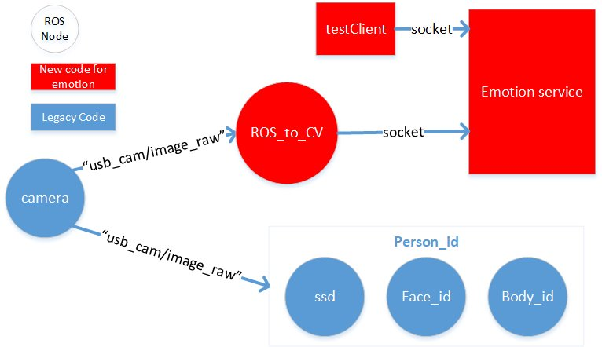

# Adaptive Emotion Recognition

This repository is about adaptive emotion recognition system containing four modules: 
- Multiview learning (e.g. face, body/head pose, hand gestures); 
- Context information encoding process (e.g. spatial, sematic information);
- Network bone (e.g. customed network bones for emotion classification);
- Uncertainty estimation (e.g. confidence measure and co-training confidence level)


## To do list
- modeling for encoding context information for emotion state prediction
- update body model to be lightweight 

## Dataset

- For the facial epxression: we use ICML2013 challenge dataset: FER2013. a set of 28,709 pictures of people displaying 7 emotional expressions (angry, disgusted, fearful, happy, sad, surprised and neutral). 
- We have another reorganized dataset, having three catagories: positive (happy); netural; negative (angry, digusted, fearful, sad)
- You can either retraining the model: Download `fer2013.tar.gz` and decompress `fer2013.csv` in the `./data` folder.
- You can also use our re-organized dataset.

## Steps for using the codes

- Create virtual environment
```
conda create -n yourenvname python=3 anaconda
```

- Install the required the packages inside the virtual environment 
```
source activate yourenvname
pip install -r requirments.txt
```

- Preprocessing the dataset using provided `cvs_to_numpy.py`
```
$ python cvs_to_numpy.py
```


### Option 1: You can play with the codes yourself for training the model with your own datasets, as

```
$ python emotion_recognition.py train
```

### or

### Option 2: Do the inference, using our trained model.
The trained model and dataset can be downloaded from `http://ghu3-desktop.bj.intel.com/models/adaptive_emotion_recognition`. Model ended with "_3" is for **3** emotion state  
```
assume the model and data are downloaded to $MODEL
$ cp -r $MODEL/model/* $MODEL/data/* data/
```
## Software Design
The emotion detection is running as a service in the background. It can be connected from a ROS node or a python3 client.

## Run the Code
### Standalone Version
Using images for testing, please run
```
$ python Demo_emotion_test.py
```

Using your laptop camera, please run
```
$ python emotion_recognition.py poc
```

### Standalone Version with a service
```
start the emotion recognition service
$ python emotion_server.py
start the client
$ python test_client.py "MP4 file"or"Number of the camera video device such as 0/1/2"
```

### The ROS version please run
```
start the emotion recognition service
$ python emotion_server.py
start the ROS node
$ python ros_to_cv2.py
```
